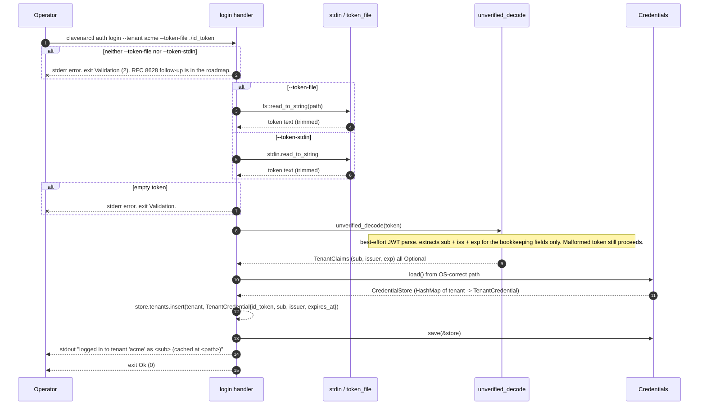
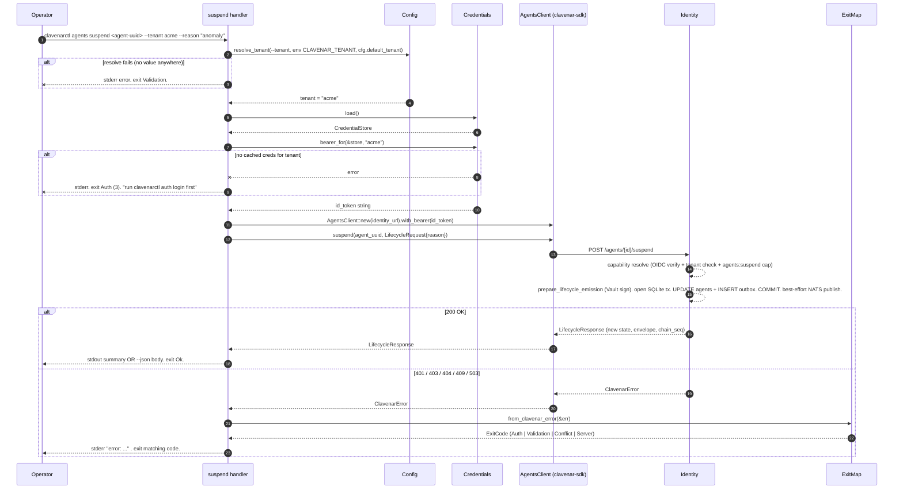
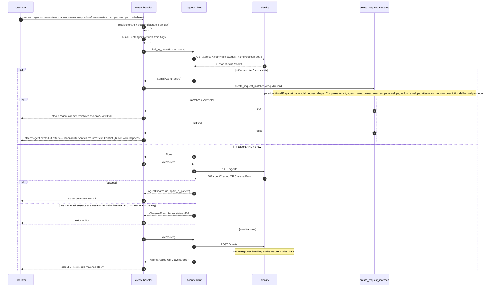
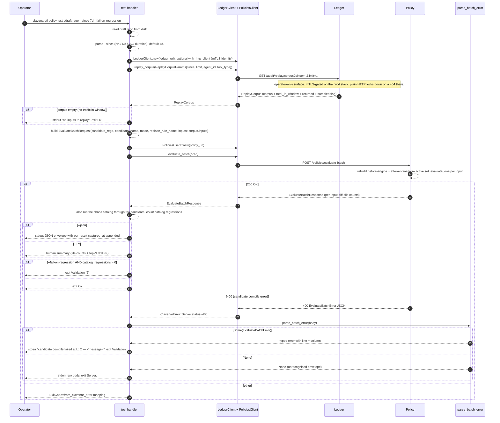
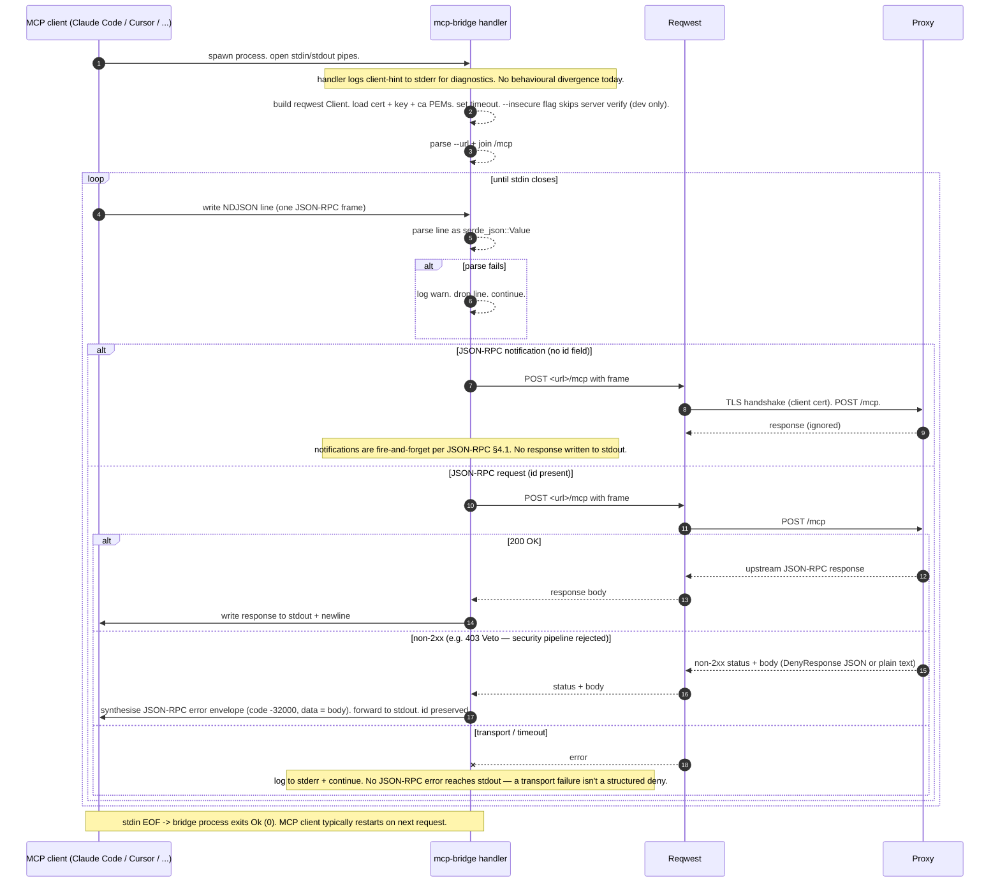
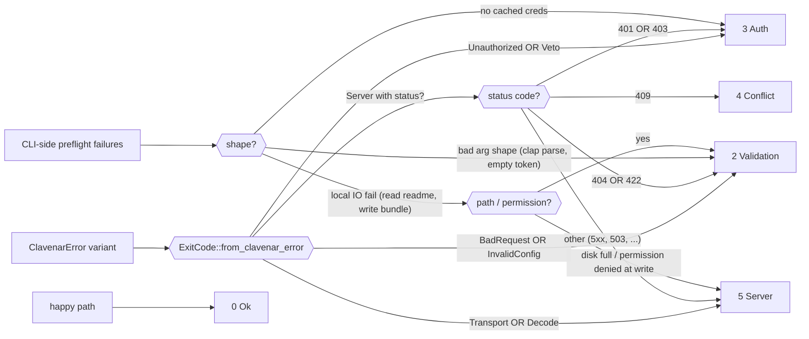

# clavenar-ctl sequence diagrams

Operator CLI for Clavenar. Every diagram below traces one
subcommand from the shell prompt through `clavenar-sdk` and out to a
clavenar service, ordered against the actual source: `src/main.rs`,
`src/cmd/*.rs`, `src/credentials.rs`, `src/config.rs`.

## Lifelines

| Lifeline | Role | Source |
|---|---|---|
| Operator | Human at the shell or a CI runner. | — |
| Clavenarctl | The CLI process — dispatcher in `main.rs`, subcommand handler in `cmd/*.rs`. | `src/main.rs::run` |
| Credentials | OS-correct credentials file. Linux: `~/.config/clavenar/credentials.json`. Carries one `TenantCredential` per tenant. | `src/credentials.rs` |
| Config | `~/.config/clavenar/config.toml` — service URLs, default tenant, output formatting. | `src/config.rs` |
| SDK | `clavenar-sdk` typed clients: `AgentsClient`, `LedgerClient`, `PoliciesClient`. | external |
| Identity | `clavenar-identity` — agents lifecycle. | external |
| Ledger | `clavenar-ledger` — `/audit/replay/corpus`, `/export/regulatory`. | external |
| Policy | `clavenar-policy-engine` — `/policies/evaluate-batch`, `/policies/mine`. | external |
| Proxy | `clavenar-proxy` mTLS `/mcp` — the mcp-bridge target. | external |
| HIL | `clavenar-hil` — `/decision-link/verify`, `/decide/{id}` over mTLS; the `pending decide` target. | external |
| MCPClient | Real MCP client (Claude Code, Cursor, Cline, Continue, Codex, generic) — talks to clavenarctl over stdio. | external |
| ExitMap | `ExitCode::from_clavenar_error` — spec §9.3 mapping. | `src/main.rs::ExitCode` |

Every subcommand resolves three things up-front: the service URL
(flag → env → config → built-in), the tenant (flag → env → config),
and the bearer (`credentials.bearer_for(&creds, tenant)`). Failures
in any of these surface as `Validation` (bad URL / arg shape) or
`Auth` (no cached creds) before any network call.

---

## 1. `clavenarctl auth login` — cache an OIDC id_token

Initial surface is "manual paste" — read a pre-minted `id_token`
from `--token-file` or `--token-stdin` and cache it. RFC 8628
device-authorization-grant lands later. The unverified decode at
login time is bookkeeping only; the server is the authoritative
verifier on first use.



**Non-obvious behaviour.**

- Login does **not** verify the token. A malformed paste is
  allowed through with `sub`/`iss = None` — the server rejects it
  on the first real call, surfacing a clearer error than a local
  signature-verify failure would. This matches the e2e runner's
  pattern of minting tokens via dex's password grant and stuffing
  the credentials file directly.
- The credentials file lives at the OS-correct path
  (Linux: `~/.config/clavenar/credentials.json`). The path is
  exposed in stderr on login so an operator can `cat` it to
  inspect what was stored.
- `--token-file` and `--token-stdin` are mutually exclusive at
  clap-parse time (`conflicts_with`). One must be supplied —
  there is no implicit reading.
- `logout` is a pure delete-key-from-HashMap with a `no-op` exit
  Ok when the tenant was not cached. `whoami` is the same load
  flow with no save.

---

## 2. `clavenarctl agents <lifecycle-verb>` — bearer-authenticated write

Representative lifecycle write (suspend / unsuspend / decommission
/ envelope-narrow / envelope-widen / transfer / description). All
share the same plumbing — load creds, resolve tenant, build
`AgentsClient`, call SDK method, map error to typed exit code.



**Non-obvious behaviour.**

- The tenant resolver is **strictly priority-ordered**: CLI flag
  beats env, env beats config. There is no implicit single-tenant
  fall-through — multi-tenant operators get a loud error rather
  than silently writing to the wrong tenant.
- `ClavenarError` mapping is shared via `ExitCode::from_clavenar_error`
  in `main.rs`. Every subcommand routes through it so the spec
  §9.3 exit-code contract has one update site. Adding a new
  4xx-mapping pattern in one place automatically covers every
  subcommand.
- The bearer is per-call (the SDK client carries it on the
  builder). Re-running with a different `--tenant` rebuilds the
  client — no token caching beyond the on-disk credentials file.
- Tenant-mismatch on a `get`/`suspend`/etc. returns 404 from the
  server (not 403) to avoid leaking row existence across
  tenants. `ExitCode::Validation` (2) is the matching exit —
  same as a typo'd UUID.

---

## 3. `clavenarctl agents create --if-absent` — idempotent IaC pattern

The "IaC without Terraform" pattern called out in spec §5.2. A
pre-fetch by `(tenant, agent_name)` decides whether to POST. On a
match, exit Ok; on a mismatch, exit Conflict (4) **without
writing** — drift requires operator intervention.



**Non-obvious behaviour.**

- The `--if-absent` mismatch path **deliberately does not auto-fix**.
  Drift between the operator's desired state and the registry is
  surfaced as exit code 4 (Conflict); a CI step running this in a
  loop will fail loudly instead of clobbering live config. The
  spec calls this out as the expected IaC behaviour for the
  agent registry.
- The pre-fetch + post is **not atomic**. A concurrent writer
  between `find_by_name` and `create` produces a 409
  `agent_name_taken` — same exit code 4 as the drift case.
  Operators reading exit codes do not need to distinguish these.
- `create_request_matches` is a pure function exposed at the SDK
  crate root specifically so the CLI can reuse the comparison
  logic. Any field added to `CreateAgentRequest` or `AgentRecord`
  needs a corresponding match in this helper, or the
  `--if-absent` path silently treats the new field as
  "matches anything."
- Decommissioned rows count for name-uniqueness. The spec
  explicitly forbids reusing an agent name even after
  decommission; a `--if-absent` create against a decommissioned
  row's name surfaces a mismatch (states differ).

---

## 4. `clavenarctl policy test` — Policy Lab CLI driver

Replay a candidate Rego rule against the last N days of real
ledger traffic. Two services, two SDK clients, one verdict. The
`--fail-on-regression` flag makes this CI-friendly.



**Non-obvious behaviour.**

- The corpus pull and the batch evaluation hit **two distinct
  services**. The CLI takes both URLs as separate flags
  (`--ledger-url`, `--policy-url`) and the SDK builds two distinct
  clients — there is no implicit "clavenar URL". Defaults come from
  `CLAVENAR_LEDGER_URL` and `CLAVENAR_POLICY_URL` env, then
  `localhost`.
- `/audit/replay/corpus` is **operator-only** on the prod stack
  (mTLS-gated on the ledger's internal listener). Without
  `--client-cert` / `--client-key` / `--ca-cert` the CLI falls
  back to plain HTTP and gets a 404 from the public listener,
  which the Caddyfile leaves off the proxied path.
- The chaos catalog half is wired through a path-dep on
  `clavenar-console`'s `clavenar-chaos-catalog`. The CLI implements a
  minimal catalog wrapper inline so the binary stays light; the
  catalog itself is the same 40-attack corpus the console renders.
- `--fail-on-regression` exits 2 (Validation), not 5 (Server) —
  a regression is "your candidate is wrong," not "the platform
  failed." CI matrices keying off exit codes can treat regression
  failures the same as parse failures.
- `clavenarctl policy learn` (Self-Learn miner) is a sibling
  subcommand with the same dual-client shape. The miner adds an
  optional Brain enrichment step and an `--accept <id>` /
  `--accept-all-safe` flow that POSTs the candidate as an
  inactive draft via the same `PoliciesClient::create` write
  path the console uses.

---

## 5. `clavenarctl mcp-bridge` — stdio MCP shim

Real MCP clients (Claude Code, Cursor, Cline, Continue, Codex,
generic stdio) register stdio binaries via `mcp add`. The proxy
expects mTLS HTTP. This subcommand bridges the two: NDJSON
JSON-RPC over stdin/stdout ↔ `POST /mcp` over reqwest with a
client cert.



**Non-obvious behaviour.**

- This is a **smoke-flow shim**, not a production agent runtime.
  No SVID renewal, no session resumption, no streaming responses.
  When those become real requirements the shim promotes to its
  own repo. The current scope target is `S-MCP-01` in
  `clavenar-e2e/MANUAL_TESTS.md`.
- `--insecure` skips server cert validation. Sensible only against
  the dev stack — `clavenar-proxy/scripts/gen_certs.sh --env dev`
  mints `server.crt` with `CN=localhost` and no SAN, which
  rustls rejects per RFC 6125. Prod issues SVID-shaped certs
  with proper SANs; do not pass `--insecure` there.
- `--client-hint` is logged but does not change behaviour today.
  The flag reserves the surface for per-client quirks (e.g. a
  client that needs a non-standard `initialize` shape) without
  re-plumbing the CLI. The hint values match
  `clavenar-ctl/docs/clients/` recipe filenames so an operator
  can grep for their client's quirks.
- The proxy's HIL Review path can hold a request for the full
  TTL (default 1800s). The bridge's 30s default timeout deliberately
  does NOT cover that case — an unattended approver scenario
  should not hold the MCP client's stdin hostage indefinitely.
  Bump `--timeout-secs` only when the operator is co-located
  with an approver.

---

## 6. `clavenarctl pending decide` — signed decision-link redemption

A channel-carried decision link (Slack / Teams / PagerDuty / webhook /
SMTP card, or one minted via `GET /pending/{id}/decision-link`) redeemed
one-shot from the terminal. The token is a *pointer + action claim*,
never a bearer credential: deciding still needs the operator's own
standing authority — an mTLS client cert in HIL's caller allowlist
(`CLAVENAR_HIL_ALLOWED_CALLERS`) **plus** the trusted-caller bearer
(`CLAVENAR_HIL_DECIDE_TOKEN`). A leaked link alone decides nothing, and
the action is signature-bound so an `approve` link can't be replayed as
a `deny`.

```mermaid
sequenceDiagram
    autonumber
    participant Operator
    participant Clavenarctl as decide handler
    participant Reqwest as mTLS client
    participant HIL

    Operator->>Clavenarctl: clavenarctl pending decide <token> --cert .. --key .. --ca .. [--yes]

    alt --hil-url / CLAVENAR_HIL_URL unset
        Clavenarctl--xOperator: stderr error. exit Validation (2).
    end

    Clavenarctl-->>Clavenarctl: build_client — cert + key + ca PEMs, timeout. --insecure skips server verify (dev only).
    alt cert/key/ca read or PEM-parse fails
        Clavenarctl--xOperator: stderr. exit Validation.
    end

    Note over Clavenarctl,HIL: Step 1 — verify (ungated). No decide bearer needed yet.
    Clavenarctl->>Reqwest: POST <hil>/decision-link/verify {token}
    Reqwest->>HIL: TLS handshake (client cert). POST.

    alt transport error
        Reqwest--xClavenarctl: error
        Clavenarctl--xOperator: stderr. exit Server (5).
    else non-2xx
        HIL-->>Clavenarctl: status
        Clavenarctl--xOperator: exit_for_status — 401/403 Auth, 404/400/422 Validation, 409 Conflict, else Server.
    else 200 OK
        HIL-->>Clavenarctl: VerifyResponse{valid, reason, pending_id, action, pending}
        alt valid == false
            Clavenarctl--xOperator: explain_invalid(reason). expired/invalid/gone -> Validation; not_pending -> Conflict.
        else valid, missing pending_id / action
            Clavenarctl--xOperator: stderr. exit Server.
        else valid
            Clavenarctl-->>Operator: print_pending (agent, method, status, correlation, risk)
        end
    end

    alt no --yes
        Clavenarctl-->>Operator: stdout "dry run — re-run with --yes". exit Ok (0). Nothing decided.
    else --yes
        alt --decide-token / CLAVENAR_HIL_DECIDE_TOKEN unset
            Clavenarctl--xOperator: stderr. exit Auth (3).
        end
        Clavenarctl-->>Clavenarctl: resolve_stamp — --as, else ctl:$USER, else clavenarctl
        Clavenarctl->>Reqwest: POST <hil>/decide/{pending_id} (bearer decide_token, x-clavenar-decided-by: stamp) {decision: action, decided_by, reason?, decided_via: "terminal"}
        Reqwest->>HIL: POST
        alt transport error
            Reqwest--xClavenarctl: error
            Clavenarctl--xOperator: stderr. exit Server.
        else 200 OK
            HIL-->>Clavenarctl: settled — decided_via=terminal stamped on the chain row
            Clavenarctl-->>Operator: stdout "<action>d pending <id> as <stamp>". exit Ok.
        else non-2xx (409 already settled, 401/403 caller not allowed, ...)
            HIL-->>Clavenarctl: status + body
            Clavenarctl--xOperator: exit_for_status — 409 -> Conflict.
        end
    end
```

**Non-obvious behaviour.**

- The token is a **pointer + action claim, not a bearer.** The verify
  step (`POST /decision-link/verify`) is ungated and only confirms the
  signature, expiry, and that the pending is still actionable. The
  actual decide (`POST /decide/{id}`) rides HIL's trusted-caller path:
  an allowlisted mTLS client cert **and** the `CLAVENAR_HIL_DECIDE_TOKEN`
  bearer. A copied link can be previewed by anyone who can reach HIL,
  but only a standing operator can apply it.
- **Dry run by default.** Without `--yes` the command verifies and prints
  the pending, then exits Ok having decided nothing — the safe default
  for a mutating one-shot. `--yes` is the explicit apply gate.
- The action is **signature-bound** — `approve` / `deny` is baked into
  the signed token, so a redeemer can't flip an `approve` link into a
  `deny`. The CLI forwards `decision: action` verbatim from the verified
  token, never from a flag.
- Every applied decision stamps `decided_via: "terminal"` in the body
  and the `x-clavenar-decided-by` header (the `--as` stamp, else
  `ctl:$USER`, else `clavenarctl`), so the audit chain distinguishes a
  terminal redemption from a console / channel one.
- A **409 on the decide call** means the pending already settled (raced
  by another approver, or expired) — mapped to `Conflict` (4) via
  `exit_for_status`, the same code `explain_invalid`'s `not_pending`
  reason yields on the verify step. Re-redeeming a spent link loses
  loudly rather than double-deciding.

---

## Exit code mapping (spec §9.3)



**Invariants.**

- Every subcommand routes server errors through
  `ExitCode::from_clavenar_error`. The mapping is **kind-of-error,
  not kind-of-HTTP-status**: auth-layer (401/403) collapses to 3,
  schema-shape (400/422) collapses to 2, conflict (409) is its
  own code, everything else is 5. CI matrices grep on the exit
  code; the body is for the operator.
- `Veto` (from `ClavenarClient`) maps to `Auth`. The mcp-bridge
  does not actually return this exit code today (it forwards the
  error to the MCP client over stdout instead of failing the
  process) but the mapping is preserved for symmetry with the
  rest of the SDK surface.
- `ClavenarError` is `#[non_exhaustive]`. The catch-all arm in
  `from_clavenar_error` returns `Server` on unknown variants — a
  CLI must not panic on a future error variant, but it also must
  not silently exit 0.
- Local IO failures collapse to `Validation` for path /
  permission errors (operator typo) and `Server` for runtime IO
  problems (disk full, EPIPE). The split lets CI distinguish "the
  operator passed a bad flag" from "the platform was unhealthy."

---

## Source pointers

- Top-level dispatcher + exit-code mapping: `src/main.rs` (`run`,
  `ExitCode::from_clavenar_error`)
- Auth surface: `src/cmd/auth.rs` (`login`, `logout`, `whoami`)
- Credentials file: `src/credentials.rs` (`load`, `save`,
  `bearer_for`, `unverified_decode`, `credentials_path`)
- Config resolver: `src/config.rs` (`resolve_tenant`,
  `Config::load`)
- Agents lifecycle: `src/cmd/agents.rs` (`list`, `get`, `create`,
  `suspend`, `unsuspend`, `decommission`, `envelope`, `transfer`,
  `description`)
- IaC pattern: `src/cmd/agents.rs::create` (`--if-absent` branch
  via `clavenar_sdk::create_request_matches`)
- Bulk migration: `src/cmd/migrate.rs`
- Policy Lab + Self-Learn: `src/cmd/policy_lab.rs` (`Test`,
  `Learn` subcommands; `--accept`, `--accept-all-safe`,
  `--fail-on-regression`)
- Policy scaffolds + library: `src/cmd/policy_scaffold.rs`,
  `src/cmd/policy_library.rs`
- Regulatory bundle: `src/cmd/regulatory.rs::export`
- Health probe: `src/cmd/doctor.rs` (multi-service `/health`
  fan-out with `--only-configured` skip)
- MCP bridge: `src/cmd/mcp_bridge.rs` (`build_client`, NDJSON
  loop, notification vs request branching)
- Pending decide (signed decision-link redemption):
  `src/cmd/pending.rs` (`decide`, `build_client`, `resolve_stamp`,
  `explain_invalid`, `exit_for_status`)
- Client recipes: `docs/clients/*.md`
